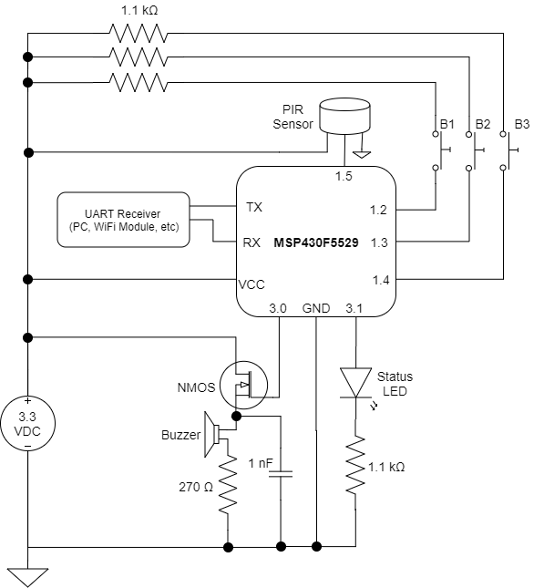

# SAIF: Security at its Finest
Developed by David Sheppard 
Created: December 10, 2018 
Last Modified: December 18, 2018 (commented and cleaned up code)
## Purpose
The SAIF system acts as a motion sensor that can be implemented as a security system. When the motion sensor is triggered, the users has 10 seconds to enter the correct combination on the buttons before a buzzer goes off and an intruer alert is sent via UART.
## Setup
### Components Needed
* MSP430F5529LP Microcontroller
* PIR Sensor
* Buzzer
* NMOS
* 1.1 k<TD>&Omega;</TD> Resistor (x4)
* 270 <TD>&Omega;</TD> Resistor
1 nF Bulk Capacitor
## Ports
* 1.2: button 1
* 1.3: button 2
* 1.4: button 3
* 1.5: output of PIR
* 3.0: status LED (on when combination entered is correct)
* 3.1: Buzzer NMOS control
### Circuit Setup
The entrie system can be implemented on a breadboard with a 3.3 VDC pwer supply. The schematic for setup is shown below.

### UART Setup
Basics:
* 115200 baud rate
* Set terminal to display in ASCII 
Specifics: 
The SAIF system uses UART serial communication to provide status updates when an intrusion is detected. To read this information on a PC, Realterm (or a comparable terminal program) must be installed. The terminal must be set to receive information from the correct COM port. To determine the correct COM port, open the computer’s device manager and look for the category "Ports (COM & LPT)." Click the dropdown menu to view all ports and find the one that says "MSP Application UART1 (COMX)," where "X" is the COM port number. This is the number that must be entered in Realterm under the Port tab. The baud rate must also be set to 115200 before clicking "Change" and "Open" on the terminal. Additionally, the display setting under the "Display" tab should be set to "Display as ASCII" in order to properly read in the information.
## Use
The system initializses to standby mode, where it is waiting for the PIR sensor to trigger. Once it triggers, the user has 10 secondsto enter the correct combination (1,2,3,1,1) by pressing the 3 buttons on the breadboard. If they fail to enter the correct combination (or any at all), the buzzer will sound for 10 seconds and the word "Intruder" will be sent over UART. After that, the system goes back to standby mode.
## Note
* The code is dependent upon the MSP430F5529.h header file and must e compiler in Code Compose Studio.
* Code was written in CCS version 8.1.0
